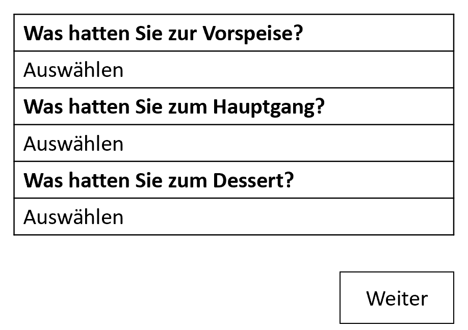
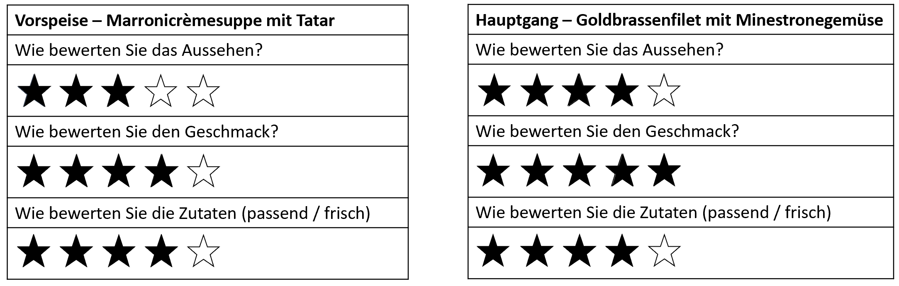
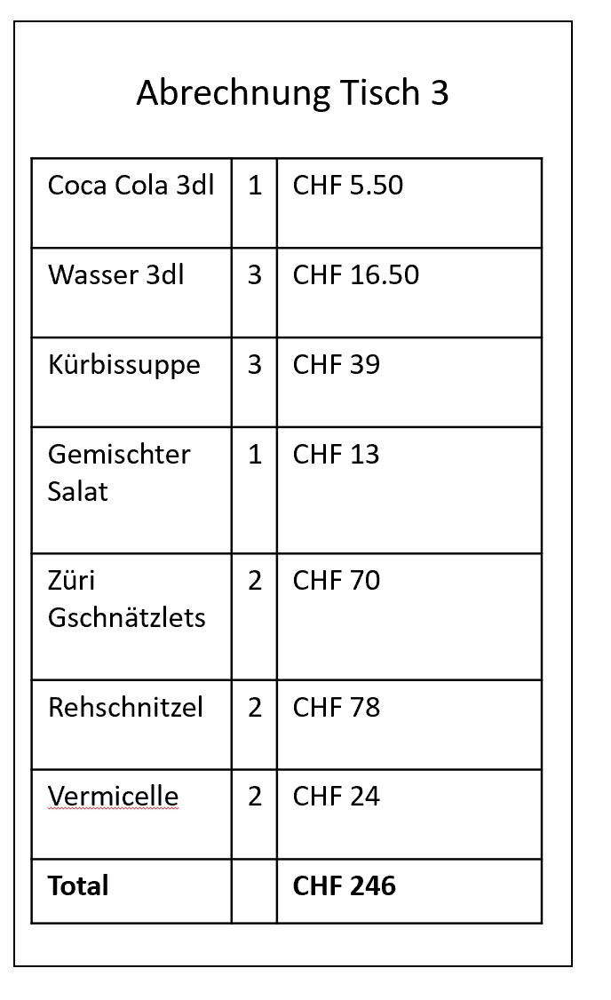

# Projekt "Restaurant Hirschen"

**Ausgangslage**
Das Restaurant Hirschen in Oberägeri wird regelmässig von vielen Gästen besucht. Das Gasthaus ist in drei Bereiche aufgeteilt: Das "Beizli", den Saal und die Terrasse. Insgesamt haben 65 Gäste platz. 
Die Tische werden ab und zu umgestellt, beispielsweise wenn eine grössere Gruppe reserviert, werden die Tische Nr. 14 und 15 zusammengeschoben. In den letzten Monaten gab es öfters einen Wechsel der Servicemitarbeiter und wie man weiss, braucht es eine gewisse Zeit, um diese einzuarbeiten. Dazu gehört eben auch, dass sie sich mit der Tischordnung vertraut machen.
Das kann für den Anfang etwas kompliziert sein und die neuen Mitarbeiter verwirren.

**Projektidee**
Um neuen Mitarbeitern sowie Aushilfe-Angestellte, welche unregelmässig im Restaurant arbeiten, den Arbeitsalltag etwas zu erleichtern, soll eine Applikation entwickelt werden. Diese soll die Aufteilung der Tische und den dazugehörigen Plätzen (Stühle) aufzeigen. Falls Gäste reservieren, soll deren Name auf dem Tisch im System angezeigt werden. Die Bestellung kann direkt in der Anwendung aufgenommen werden, so wird auch sichergestellt, dass die einzelnen Personen gleich das richtige Gericht erhalten (ohne dass man nachfragen muss). Des Weiteren soll dies auch den Abrechnungsprozess vereinfachen, da angegeben werden kann, ob zusammen oder einzeln bezahlt wird.

**Workflow**
> Dateneingabe: 
> * Name der Gäste, die reserviert haben (z.B. Meier) 
> * Bestellte Getränke und Gerichte pro Gast

Datenverarbeitung / Speicherung:
> * Preise pro Gast bzw. pro Tisch berechnen
> * Bezahlungsprozess
> * Tischordnung ("übliche" und "neu")

Datenausgabe:
> * Rechnung
> * Umsatz pro Tag / Monat 

# Visuelle Darstellung

# Flowchart
> Szenario 1 - Einrichtung

> Szenario 2 - Gäste platzieren

> Szenario 3 - Bestellung aufnehmen und servieren

> Szenario 4 - Einkassieren

    
    
